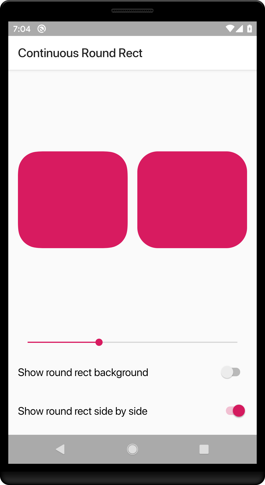

# ContinuousRoundRect
Smooth round rect path for Android. Inspired by UIKit `continuousCorners` and Sketch `Smooth Corners`.

Use 3 Bézier curves to simulate the round corner, which creates somooth and continuous transition between the round corner and the adjancent straight line.

## Screenshots

